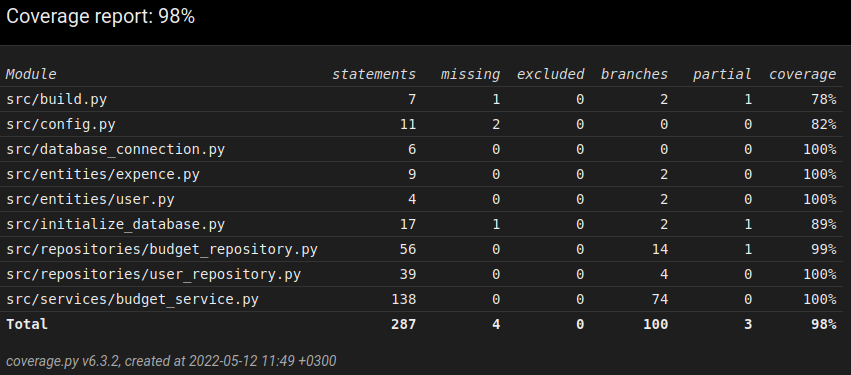

# Testausdokumentti

Ohjelman testaus on suoritettu automatisoiduin unittesteillä sekä manuaalisesti testatuin järjestelmätason testeinä

## Automatisoidut testit

### Sovelluslogiikka

Sovelluslogiikasta vastaava `BudgeService`-luokka testataan -luokalla. 
Testausta varten `BudgetService`-luokan alustus toimii niin, että sille injektoidaan riippuvuuksiksi repositorio-oliot, jotka pysyväistallennuksen sijasta
tallentavat tiedot vain muistiin. Testejä varten on luotu luokat `FakeBudgetRepository` ja `FakeUserRepository`, jotka hoitavat tallennuksen testeissä.

### Repositoriot

Repositorio luokkia `BudgetRepository` ja `UserRepository` testataan luokilla  ja . Testauksessa käytetään oikeita tiedostoja, jotta toimivuus saadaan testattua oikean mukaiseksi.
Repositorioiden testauksessa käytettävät tiedostot eivät ole samat kuin sovelluksen muun käyttämät ja ne on määritelty juurihakemistossa löytyvässä _.env.test_ tiedostossa.

### Testauskattavuus

Käyttöliittymä pois lukien sovelluksen testauskattavuus on 98%

Testaus ei suorita _build.py_ tai _initialize_databse.py_ komentoriviltä. Testaus ei testaa tilannetta, jossa yritetään hakea kirjautumattoman
käyttäjän budjettia.

## Järjestelmätestaus

### Asentaminen ja konfigurointi

Sovellus on haettu ja sitä on testattu  kuvaamilla ohjeilla Linux-ympäristössä. Testauksessa on käytetty myös eri konfiguraatioita _.env_-tiedostossa

Sovelluksen testauksessa on testattu sekä tilannetta, jossa tiedostot ja tietokannat ovat jo olemassa sekä tilanteissa, missä niitä ei ole vielä olemassa.

### Toiminnallisuudet

 määrittelemät toiminnallisuudet on testattu. Toiminnallisuuksia testatessa on testattu myös virheelliset syötteet, kuten kirjaimet numero syöttö kentissä sekä tyhjät kentät.

## Sovellukseen jäääneet laatuongelmat

Sovelluksesta löytyy seuraavat ongelmat:

- SQLite tietokantaa ei ole alustettu, eli sovellusta yritetään suorittaa ilman, että on suoritettu `poetry run invoke build` komentoa, ei tuota järkevää virheilmoitusta järjestelmään
- Jos tiedostojen nimiä muutta .env tiedostossa ja suorittaa uudestaan `poetry run invoke build`, vanhat tiedostot, joilla on eri nimi, eivät poistu data-kansiosta
