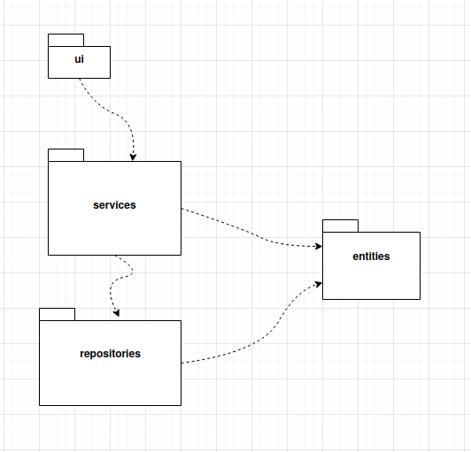
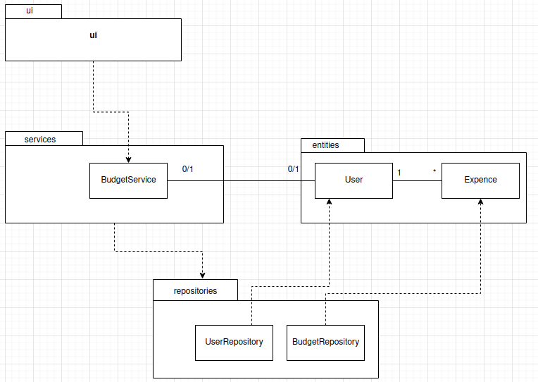
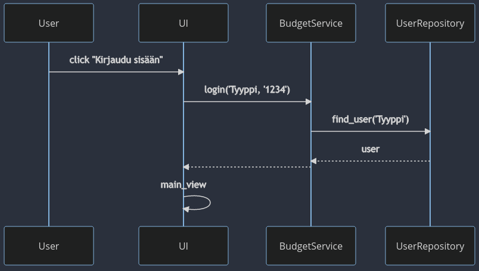
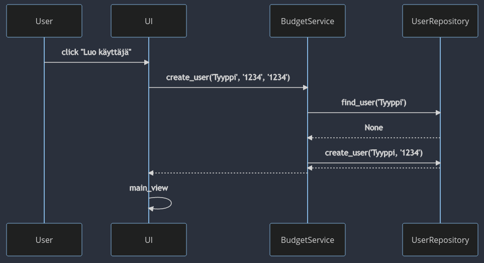
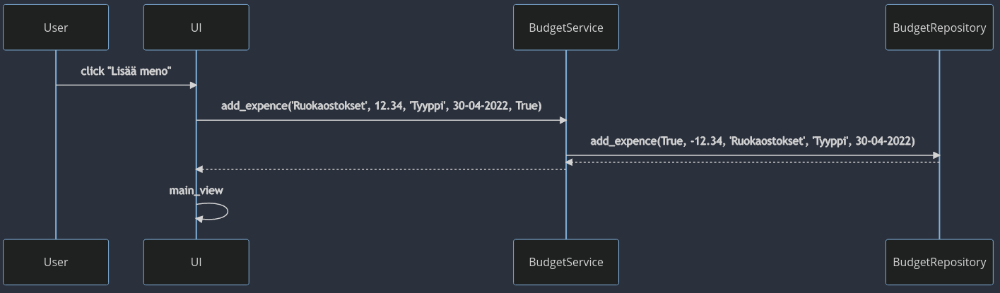
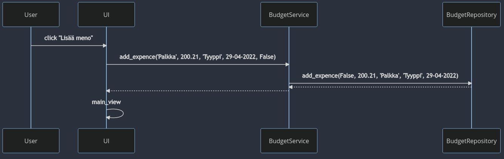
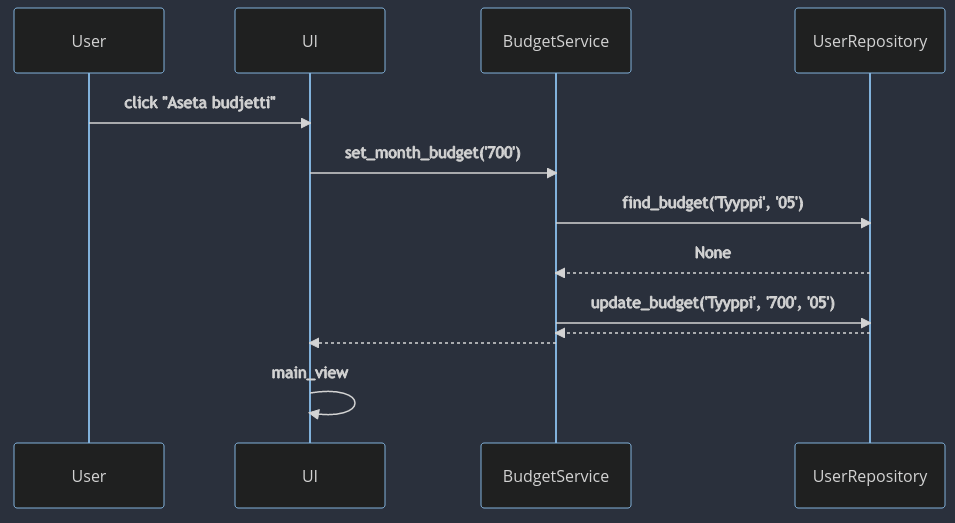
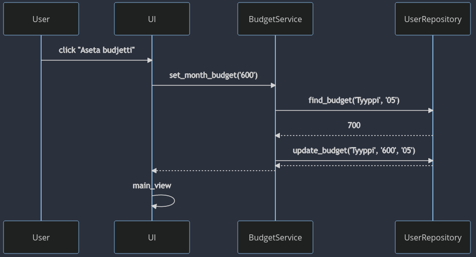

# Arkkitehtuuri

## Rakenne

Pakkauskaavio sovelluksen toiminnasta



## Sovelluslogiikka

Sovelluksessa luokat [Expence](https://github.com/T-Marenk/ot-harjoitustyo/blob/main/src/entities/expence.py) ja [User](https://github.com/T-Marenk/ot-harjoitustyo/blob/main/src/entities/user.py) muodostavat pohjan sovelluksessä käytettäville käyttäjille sekä menoilla/tuloille. Näitä voidaan kuvata seuraavasti:


Sovelluksen suurimmasta osasta toiminnallisuudesta vastaa luokka [BudgetService](https://github.com/T-Marenk/ot-harjoitustyo/blob/main/src/services/budget_service.py), joka tarjoaa sovellukselle muun muassa seuraavat metodit:

- `add_expence(description, amount, username, date, expence)`
- `create_user(username, password)`
- `this_month_budget(username)`
- `delete_expence(expence_id)`

Yhteydestä tietokantaan sekä tiedostoihin hoitavat [BudgerRepository](https://github.com/T-Marenk/ot-harjoitustyo/blob/main/src/repositories/budget_repository.py) ja [UserRepository](https://github.com/T-Marenk/ot-harjoitustyo/blob/main/src/repositories/user_repository.py) luokkien oliot ja metodit

Luokkien välistä suhdetta kuvaava luokkakaavio:


## Pysyvä tallennus

Sovelluksella on kaksi tapaa tallentaa tietoa pysyvästi. `BudgetRepository` huolehtii menojen ja tulojen tallentamisesta, jotka tallennetaan 
CSV tiedostoon ja `UserRepository` tallentaa käyttäjät ja niihin liittyvät tiedot, jotka puolestaa tallennetaan SQLite-tietokantaan. 

### Tiedostot
Menot ja tulot sekä käyttäjät tallennetaan erillisiin tiedostoihin. Tiedostojen nimet määritellään juurihakemistosta löytyvässä [.env](https://github.com/T-Marenk/ot-harjoitustyo/blob/main/.env)-tiedostossa.

`BudgetRepository`-luokka tallentaa CSV-tiedostoon seuraavalla tyylillä:
```
5dd09b8b-8f5b-450d-bb8d-f37cd9f0b83a;False;654.32;Palkka;Tyyppi;02-05-2022
68788a8d-63d1-4c2e-940a-4eeb26fd2cac;True;-12.34;Ruokaostokset;Henkilö;30-04-2022
```
Tallenustapa on siis menon/tulon id, totuusarvo joka kertoo, onko kyseessä meno vai tulo, määrä, kuvaus, käyttäjätunnut ja päivämäärä. Osat erotetaan toisistaan puolipisteellä (;).

`UserRepository`-luokka tallentaa käyttäjät SQLite-tietokannan tauluun `users` sekä käyttäjäkohtaiset budjetit tauluun `budget`. Tietokanta alustetaan tiedostossa [initialize_database.py](https://github.com/T-Marenk/ot-harjoitustyo/blob/main/src/initialize_database.py) sovellusta rakentaessa.

## Päätoiminnallisuudet

Sovelluksen toiminnallisuuksia kuvattuna sekvenssikaavioilla

### Sisään kirjautuminen

Käyttäjä antaa käyttäjänimen ja salasanan syötekenttiin, jonka jälkeen hän painaa "Kirjaudu sisään" -nappia, josta seuraa seuraavat tapahtumat:



### Uuden käyttäjän luominen

Kun käyttäjä on syöttänyt haluamansa käyttäjänimen ja salasanan käyttöliittymässä teksikenttiin, painamalla nappia "Luo käyttäjä" tapahtuu seuraavat toimenpiteet



### Uusi meno sekä tulo

Käyttäjä antaa sovelluksessa tiedon menon tai tulon nimestä, menon/tulon määrän sekä valitsee päivämäärän, jolloin se on lisätty. Tämän jälkeen painamalla nappia "Lisää tulo" tai "Lisää meno", riippuen kumpaa lisätään, tapahtuu seuraavat tapahtumat:

Menon lisäys:



Tulon lisäsys:



### Budjetin asettaminen

Käyttäjällä on mahdollista asettaa kuukaudelle haluaman budjetin. Päänäkymästä painamalla _Aseta budjetti kuukaudelle_ -nappia, pääsee käyttäjä asettamaan kuukaudelle budjetin kirjoittamalla sen syötekenttään ja painamalla _Aseta budjetti_ tapahtuu tapahtumat seuraavasti:

Jos nykyiselle käyttäjälle ei olla vielä asetettu kuukaudelle budjettia:



Jos nykyisellä käyttäjällä on jo asetettuna budjetti kuukaudelle:




