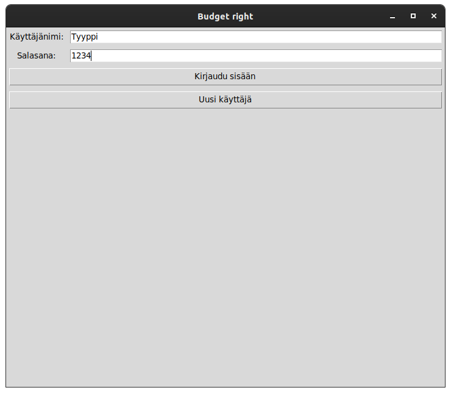
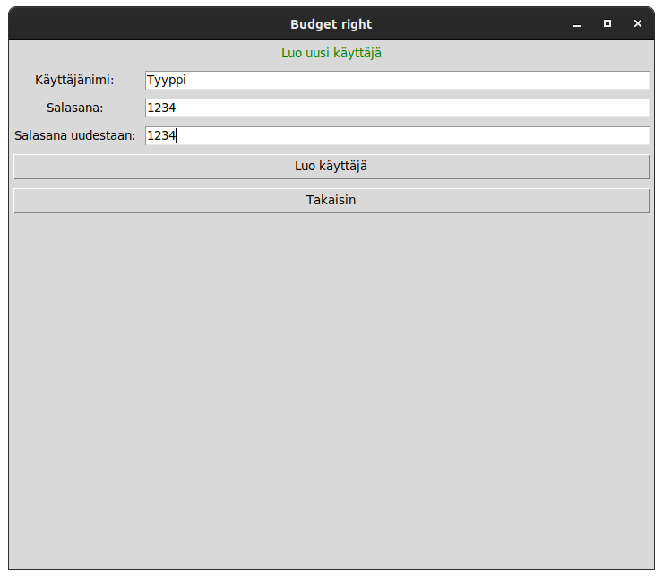
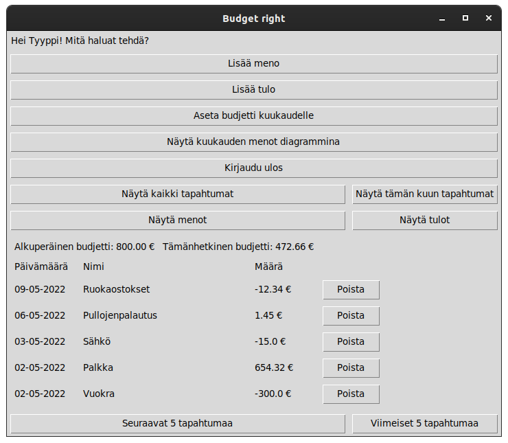
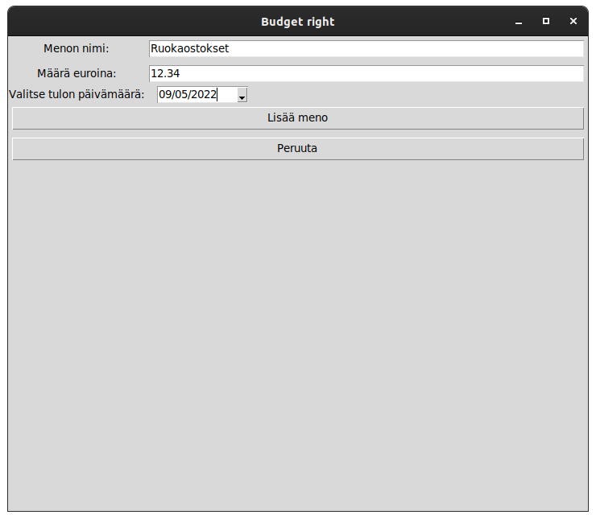
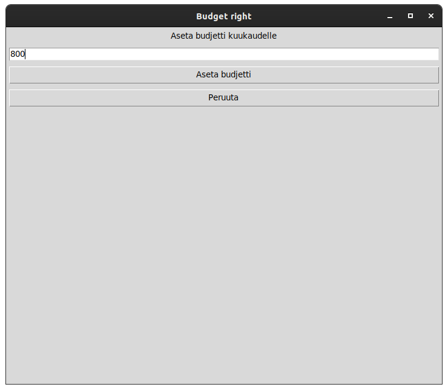
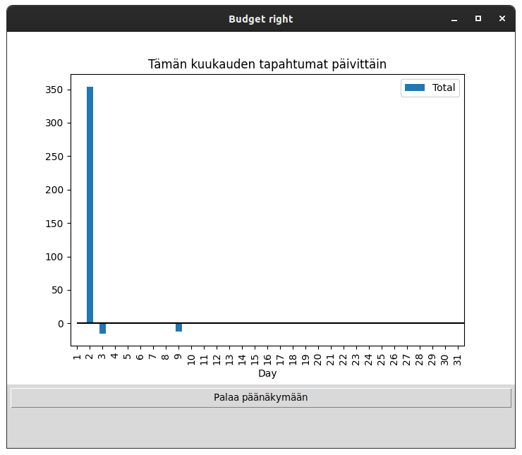

# Käyttöohje

Lataa projektin viimeisin version [releasin] _Assests_ osion alta valitsemalla _Source code_.

## Ohjelman käynnistäminen

Ennen ensimmäistä suoritus kertaa asenna tarvittavat riippuvuudet:

```bash
poetry install
```

Jonka jälkeen suorita sovellukselle alkutoimenpiteet:

```bash
poetry run invoke build
```

Tämän jälkeen voit käynnistää sovelluksen:

```bash
poetry run invoke start
```

## Kirjautuminen

Sovelluksen käynnistys käynnistää kirjautumisnäkymän:



Sisään kirjautuminen on mahdollista olemassa olevalle käyttäjälle kirjoittamalla käyttäjän käyttäjätunnus ylempään kenttään, salasana alempaan kenttään,jonka jälkeen painamalla "Kirjaudu sisään"-nappia pääsee kirjautumaan sisälle

## Uuden käyttäjän luominen

Uuden käyttäjän luomisnäkymään pääsee kirjautumisnäkymästä painamalla "Uusi käyttäjä" -painiketta

Tämä avaa seuraavan näkymän:



Kirjoittamalla syöttökenttiin uuden käyttäjän tiedot ja painamalla "Luo käyttäjä" -nappia saa luotua uuden käyttäjän

Jos käyttäjän luominen onnistuu, palaa sovellus kirjautusnäkymään

## Budjetin tarkastelu sekä menojen ja tulojen poisto

Onnistunut sisään kirjautuminen tuo esille päänäkymän.

Tässä näkymässä näkee lisätyt menot ja tulot. Painamalla "Näytä kaikki tapahtumat" näet kaikki menot ja tulot ja painamalla "Näytä tämän kuun tapahtumat" näet vain meneillään olevan kuukauden tapahtumat

Painamalla "Näytä menot" nappia näet vain menot ja painamalla "Näytä tulot" nappia näet vain tulot. Myös menoja ja tuloja voi tarkastella joko tältä kuukaudelta tai kaikkia.

Tapahtuman poistaminen onnistuu painamalla "Poista" halutun tapahtuman vieressä



Mikäli poisto onnistuu, sitä ei ole enään näkyvillä näkymässä

Tapahtumia on näkyvillä aina 5 kerrallaan, jos niitä on lisätty ainakin 5 sovellukseen. Taphtumien alla olevilla "Seuraavat 5 tapahtumaa" ja "Viimeiset 5 tapahtumaa" napeilla pääsee selaamaan tapahtumia läpi.

Painamalla näkymässä olevaa "Kirjaudu ulos" painiketta pääsee kirjautumaan ulos. Tämä näyttää taas kirjautumisnäkymän, josta pääsee kirjautumaan sisään toisella käyttäjällä

## Menojen ja tulojen lisääminen

Päänäkymästä pääsee lisäämään uuden menon tai tulon painamalla "Lisää meno" tai "Lisää tulo" nappia

Molemmat näkymät toimivat samalla tavalla. Täyttämällä vaaditut tiedot syöttökenttiin ja valitsemalla kalenterista päivämäärän, jonka jälkeen painamalla joko "Lisää meno" tai "Lisää tulo" nappia saa tapahtuman lisättyä sovellukseen

Uusi meno:



Uusi tulo:


Mikäli lisääminen onnistuu, näyttää sovellus päänäkymän, jossa juuri lisätty tapahtuma on myös näkyvillä

Tapahtumien kuvaus saa olla enintään 40 merkkiä ja määrän tulee olla positiivinen luku.

"Peruuta" napin painaminen vie takaisin päänäkymään.

## Budjetin asettaminen

Päänäkymässä olevasta napista "Aseta budjetti kuukaudelle" napilla pääsee lisäämään budjetin kuluvalle kuukaudelle. Nappi vie toiseen näkymään, jossa syötekenttään kirjoitetaan haluttu budjetti.

Lopuksi painamalla "Aseta budjetti" lisätään budjetti käyttäjälle



Mikäli lisääminen onnistuu, palaa sovellus päänäkymään asetettu budjetti näkyy tapahtumien yläpuolella kohdassa "Alkuperäinen budjetti"

"Peruuta" nappi vie takaisin päänäkymään

## Kuukausi diagrammi

"Näytä kuukauden menot diagrammina" nappia painamalla vie sovellus näkymään, jossa tulee esille päiväkohtainen pylväsdiagrammi sen kuukauden tapahtumista



"Palaa päänäkymään" nappi vie takaisin päänäkymään
