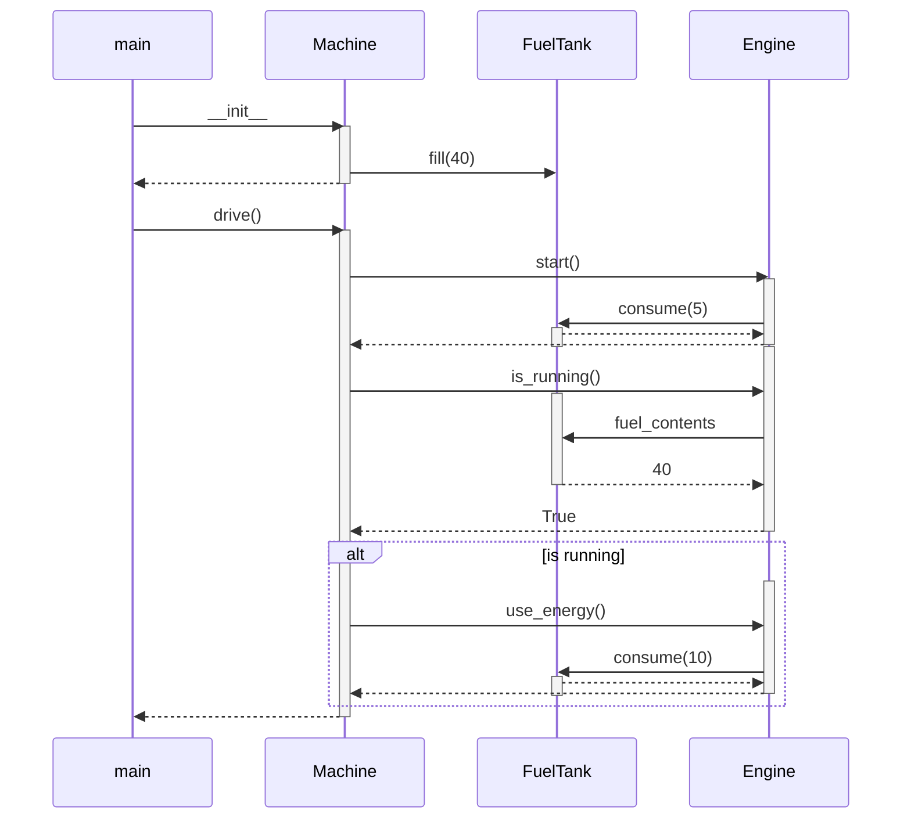

```mermaid
 sequenceDiagram
     participant main
     main->>Machine: __init__
     activate Machine
     Machine->>FuelTank: fill(40)
     Machine-->>main: 
     deactivate Machine
     main->>Machine: drive()
     activate Machine
     Machine->>Engine: start()
     activate Engine
     Engine->>FuelTank: consume(5)
     activate FuelTank
     FuelTank-->>Engine: 
     deactivate FuelTank
     Engine-->>Machine: 
     deactivate Engine
     activate Engine
     Machine->>Engine: is_running()
     activate FuelTank
     Engine->>FuelTank: fuel_contents
     FuelTank-->>Engine: 40
     deactivate FuelTank
     Engine-->>Machine: True
     deactivate Engine
     alt is running
         activate Engine
         Machine->>Engine: use_energy()
         Engine->>FuelTank: consume(10)
         activate FuelTank
         FuelTank-->>Engine: 
         deactivate FuelTank
         Engine-->>Machine: 
         deactivate Engine
     end
     Machine-->>main: 
     deactivate Machine
```
